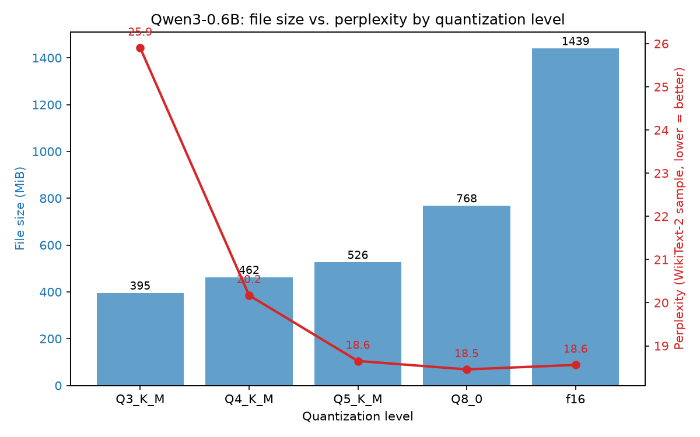

# Local LLM Quantization Benchmark

Hands-on exploration of local LLM inference and quantization on CPU-only
hardware

## Hardware used

- CPU: Intel Core i5-13500H (12 cores / 16 threads)
- RAM: 16 GB
- GPU: Intel Iris Xe (integrated, no CUDA) — all inference is CPU-only
- OS: Windows 11

## Plan

1. ✅ Build `llama.cpp` locally (CPU-only build)
2. ✅ Download a small open-weight model from Hugging Face, convert to GGUF,
   quantize at multiple levels (Q8_0, Q5_K_M, Q4_K_M, Q3_K_M)
3. ✅ Benchmark each quant level: file size, RAM usage, tokens/sec
   (prompt processing + generation), perplexity on a WikiText-2 subset
4. ✅ Test llama.cpp's native KV-cache quantization (`--cache-type-k` /
   `--cache-type-v`) and measure RAM/speed impact
5. ✅ Compare against Ollama running the same model
6. ✅ Write up results with a table and chart
7. ✅ (Stretch) Sketch a LoRA fine-tuning script for Colab (not run locally —
   fine-tuning needs a GPU this laptop doesn't have)

## Key results at a glance

- **Weight quantization** (§2): file size scales ~linearly with bits/weight
  (1439 MiB at F16 → 395 MiB at Q3_K_M), while perplexity on a WikiText-2
  sample stays flat through Q5_K_M and only degrades meaningfully at
  Q3_K_M (+40% relative to F16) — Q4_K_M is a reasonable default
  quality/size tradeoff. See the chart in §2.
- **KV-cache quantization** (§4) saves modest RAM (6-10%) at this model
  size/context length but costs real CPU throughput (-36% to -51% prompt
  processing) — the memory benefit likely grows at longer contexts, not
  tested here.
- **CPU thread scaling is non-monotonic** on this laptop's hybrid P/E-core
  CPU (§5): generation throughput peaks at 2 threads and gets *worse*
  with more, the opposite of the naive assumption. This also explained
  away what first looked like a 5x Ollama-vs-llama.cpp gap.
- **Ollama vs raw llama.cpp** (§5), same weights: Ollama's default thread
  handling beat even the hand-tuned local config (52 vs 34 tok/s
  generation) at ~3% more RAM and roughly double the disk usage (its own
  blob store duplicates the GGUF).

## Setup

Model weights, GGUF files, and the `llama.cpp` source tree are **not**
committed to this repo (see `.gitignore`) — they're either huge or trivially
re-fetchable. Below are the exact commands to reproduce the environment.

### 1. Build llama.cpp (CPU-only)

Tested on Windows with a MSYS2 UCRT64 toolchain (g++ 13.2, CMake 3.28, Ninja).
If you don't have MSYS2, install it from https://www.msys2.org/, then from
an MSYS2 UCRT64 shell:

```bash
pacman -S mingw-w64-ucrt-x86_64-cmake mingw-w64-ucrt-x86_64-toolchain ninja
```

Then, from this repo's root:

```bash
git clone --depth 1 https://github.com/ggml-org/llama.cpp.git
cd llama.cpp

# -D_WIN32_WINNT=0x0A00 works around a cpp-httplib build error on MinGW
# (it can't detect the Windows version and refuses to build without this)
cmake -B build -G "Ninja" -DCMAKE_BUILD_TYPE=Release -DGGML_NATIVE=ON \
  -DCMAKE_CXX_FLAGS="-D_WIN32_WINNT=0x0A00" -DCMAKE_C_FLAGS="-D_WIN32_WINNT=0x0A00"

cmake --build build --config Release -j 16
```

`-DGGML_NATIVE=ON` lets GGML auto-detect and use CPU instruction set
extensions available on this machine (AVX2 etc.) for faster inference.

The resulting binaries dynamically link against MSYS2's UCRT64 runtime DLLs
(`libstdc++-6.dll`, `libgomp-1.dll`, `libwinpthread-1.dll`, etc.). Copy them
next to the executables so they run without needing MSYS2 on `PATH`:

```bash
cp /c/msys64/ucrt64/bin/{libwinpthread-1,libgcc_s_seh-1,libcrypto-3-x64,libstdc++-6,libssl-3-x64,libgomp-1}.dll build/bin/
```

Verify: `./llama.cpp/build/bin/llama-cli.exe --version`

Key binaries produced: `llama-cli` (interactive/single-prompt inference),
`llama-bench` (throughput benchmarking), `llama-perplexity` (perplexity
eval), `llama-quantize` (GGUF quantization), `llama-server` (OpenAI-compatible
HTTP server).

### 2. Model download & quantization

**Model:** [Qwen/Qwen3-0.6B](https://huggingface.co/Qwen/Qwen3-0.6B) — Apache-2.0,
instruct/chat model, 0.6B params, BF16 safetensors (~1.5GB on disk). Picked
over Gemma 3n E2B because Qwen's small dense models have mature, well-tested
GGUF/llama.cpp support, while Gemma 3n's "effective 2B" MatFormer architecture
has a larger real on-disk/RAM footprint than the name suggests and newer,
less battle-tested llama.cpp support. At 0.6B params this comfortably fits
this laptop's 16GB RAM even before quantization, leaving headroom to scale up
to Qwen3-1.7B/4B later if useful.

Set up the Python environment (from repo root):

```bash
python -m venv .venv
source .venv/Scripts/activate   # Git Bash / MSYS2; use .venv\Scripts\activate on cmd
pip install -r llama.cpp/requirements/requirements-convert_hf_to_gguf.txt
pip install "huggingface_hub[cli]"
```

Then download, convert, and quantize in one go:

```bash
bash scripts/download_and_convert.sh
```

This downloads the model to `models/qwen3-0.6b-hf/`, converts it to FP16
GGUF (`models/gguf/qwen3-0.6b-f16.gguf`), then produces 4 quantized copies:

| Quant   | Size (MiB) | Bits/weight | Notes |
|---------|-----------:|-------------|-------|
| Q8_0    | 761.8      | 8.50        | Near-lossless, largest of the 4 |
| Q5_K_M  | 520.2      | 5.81        | Good quality/size balance |
| Q4_K_M  | 456.1      | 5.09        | Common "sweet spot" default |
| Q3_K_M  | 389.1      | 4.34        | Smallest, most quality loss |

(FP16 baseline is 1433.75 MiB / 16 bits-per-weight for comparison.)

Note: `hf download` is the current CLI (the older `huggingface-cli download`
is deprecated and, on Windows, crashes on a Unicode deprecation-warning
glyph under the default `cp1252` console encoding — hence
`PYTHONIOENCODING=utf-8` in the script).

### 3. Benchmarking

Install the extra script dependencies (on top of the conversion deps from
step 2):

```bash
pip install -r scripts/requirements.txt
```

The perplexity eval needs a small held-out text sample. Fetch a ~20KB
WikiText-2 subset (test split, from the `Salesforce/wikitext` dataset on
Hugging Face) once:

```bash
python scripts/fetch_wikitext_sample.py
```

Then run the benchmark suite:

```bash
python scripts/benchmark.py
```

For each quant level, this sequentially (one model in memory at a time):
- Reads file size directly from disk
- Runs `llama-bench` (256 prompt tokens / 64 generation tokens, 3
  repetitions, 8 threads) for prompt-processing and generation throughput
- Runs `llama-perplexity` over 5 chunks of 512 tokens from the WikiText-2
  sample
- Polls the subprocess's resident set size (RSS) every 100ms in a background
  thread (via `psutil`) to record peak RAM used during each run

Results are written to `results/benchmark_results.csv` and printed as a
markdown table.

**What the metrics mean:**
- **File size**: on-disk size of the GGUF weights — the main lever
  quantization pulls.
- **PP tok/s (prompt processing)**: how fast the model ingests/encodes input
  tokens (relevant for long prompts, e.g. RAG context).
- **TG tok/s (token generation)**: how fast the model produces output tokens
  one at a time — this is usually what "feels slow" to a user chatting with
  the model, and is memory-bandwidth-bound on CPU (not compute-bound), which
  is why it barely changes across quant levels here — the bottleneck is
  moving weights through RAM, not the matrix-multiply itself.
- **Peak RSS**: actual physical RAM used during the run — the practical
  ceiling on what model+quant combination fits on a given machine.
- **Perplexity (PPL)**: how "surprised" the model is by the held-out text
  (lower = the model assigns higher probability to what actually comes
  next = better fit to that text distribution). It's a relative quality
  proxy, not a benchmark of "intelligence" — useful for seeing how much a
  quantization level degrades the model's underlying language modeling
  vs. the FP16 baseline.

**Results (Qwen3-0.6B, 8 threads, this laptop):**

| Quant  | Size (MiB) | PP tok/s | TG tok/s | Peak RSS (MiB) | Perplexity |
|--------|-----------:|---------:|---------:|----------------:|-----------:|
| F16    |     1439.4 |    181.5 |      7.1 |          2331.2 | 18.56 ± 1.76 |
| Q8_0   |      767.5 |    228.6 |      8.7 |          1796.4 | 18.46 ± 1.75 |
| Q5_K_M |      525.8 |    143.1 |      8.5 |          1609.8 | 18.65 ± 1.79 |
| Q4_K_M |      461.8 |    249.3 |      8.5 |          1769.3 | 20.17 ± 1.96 |
| Q3_K_M |      394.8 |    168.9 |      8.7 |          1608.6 | 25.90 ± 2.46 |



Generate this chart yourself with `python scripts/generate_chart.py` (uses
`matplotlib`, included in `scripts/requirements.txt`).

**Takeaways:**
- File size shrinks ~3.6x from F16 to Q3_K_M (1439 MiB → 395 MiB), as
  expected from ~16 bits/weight down to ~4.3 bits/weight.
- Generation speed (TG tok/s) is nearly flat (7-9 tok/s) across all quant
  levels — on CPU, single-token generation is memory-bandwidth bound, so
  a smaller model mostly helps by needing less RAM traffic per token, but
  the gain is modest at this model size. Prompt-processing (PP) numbers are
  noisier run-to-run (background CPU contention on a laptop with only 3
  repetitions per test) and shouldn't be read as a clean scaling trend
  here — this would benefit from more repetitions in a future pass.
- Perplexity is essentially unchanged through Q8_0 and Q5_K_M (within noise
  of the F16 baseline), starts drifting at Q4_K_M, and degrades noticeably
  at Q3_K_M (+~40% relative to F16) — consistent with the general rule of
  thumb that Q4_K_M is often the "sweet spot" and quality loss accelerates
  below it.
- Peak RAM roughly tracks file size plus a fairly constant ~1.1-1.2GB of
  overhead from the perplexity run's larger batch/context buffers (batch
  size 2048 even at ctx 512) — the throughput benchmark's peak RSS is
  consistently lower than the perplexity run's for the same quant.

### 4. KV-cache quantization

Separately from weight quantization, llama.cpp can also quantize the
KV cache itself (the per-token key/value activations stored during
generation) via `--cache-type-k` / `--cache-type-v`. This is a different
lever from weight quantization — it shrinks the *runtime* memory that grows
with context length, not the fixed on-disk model size. Non-F16 cache types
require Flash Attention (`-fa on`).

```bash
python scripts/benchmark_kv_cache.py
```

This fixes the weight quant at Q4_K_M and runs a longer prompt+generation
(1024 + 256 tokens) than the main benchmark, specifically so the KV cache
is large enough relative to the model's fixed weight RAM for cache-type
differences to be visible (at short contexts the ~460MB of model weights
dominates RAM and masks any KV-cache effect).

**Results (Qwen3-0.6B Q4_K_M, 1024+256 tokens, 8 threads, `-fa on` throughout
so all three rows isolate cache-type effects rather than mixing in a
flash-attention on/off variable):**

| KV cache type | PP tok/s | TG tok/s | Peak RSS (MiB) | RSS vs F16 |
|----------------|---------:|---------:|----------------:|-----------:|
| F16 (baseline) |    214.5 |      8.3 |            787.9 |        — |
| Q8_0           |    138.3 |      6.4 |            736.4 |  -51.5 (-6.5%) |
| Q4_0           |    104.8 |      7.4 |            708.4 |  -79.5 (-10.1%) |

**Takeaway:** at this model size (0.6B) and context length (1280 tokens),
quantizing the KV cache saves relatively little RAM in absolute terms
(51-80 MiB) because the fixed model weights (~460 MiB) dominate total
memory — but it comes with a real prompt-processing speed cost on CPU
(-36% at Q8_0, -51% at Q4_0), since dequantizing the cache during attention
adds compute overhead that isn't free. Generation speed (TG) is noisier at
this scale (single-token decode is already slow and memory-bound) and
doesn't show as clean a trend. The RAM benefit of KV-cache quantization
should become more worthwhile at longer context lengths or larger models,
where the KV cache is a bigger fraction of total memory — the crossover
point wasn't reached in this test and would be a good follow-up experiment.

### 5. Ollama vs raw llama.cpp

[Ollama](https://ollama.com) wraps llama.cpp with a persistent background
service, a model library/pull system, and an HTTP API. To isolate serving
overhead from weight differences, this comparison imports our *own*
Q4_K_M GGUF into Ollama (rather than letting Ollama pull its own build of
the model) via a `Modelfile`:

```bash
cd ollama
ollama create qwen3-0.6b-q4km -f Modelfile
cd ..
python scripts/benchmark_ollama.py
```

(Requires Ollama installed and running — the installer sets it up as an
auto-starting background service on Windows.)

**A CPU-scheduling finding that shaped this comparison:** an early pass at
this benchmark showed Ollama generating tokens ~5x faster than our
llama.cpp build. Before writing that up as "Ollama is faster," I checked
whether it was actually a thread-count artifact — this laptop's CPU
(13th Gen i5-13500H) is a hybrid P-core/E-core design, and our earlier
benchmarks all used a flat `-t 8`. A quick thread sweep on `llama-bench`
(same Q4_K_M model) told a different story:

| Threads | TG tok/s |
|--------:|---------:|
| 1       |     14.3 |
| 2       |     22.3 |
| 4       |     14.5 |
| 6       |     11.1 |
| 8       |      8.5 |
| 12      |      6.0 |
| 16      |      4.7 |

Generation speed **peaks at 2 threads and degrades as threads increase** —
the opposite of the naive "more threads = faster" assumption. Single-token
decode is memory-bandwidth/latency-bound, not compute-bound, so extra
threads mostly add scheduling contention across the P-core/E-core split
without adding usable memory bandwidth. So the comparison below benchmarks
llama.cpp at both a naive default (`-t 8`) and the empirically-found sweet
spot (`-t 2`), to give Ollama a fair baseline instead of a strawman.

A second pitfall caught during this benchmark: llama.cpp's server (which
Ollama wraps) caches matching prompt prefixes per-slot, and that cache
persists across separate script runs — not just within one run. The first
version of this script reused the same fixed prompt text on every run,
which made Ollama's *second* run onward look absurdly fast (prompt
processing reported as ~6000 tok/s) because it was mostly hitting cache,
not actually reprocessing the prompt. Fixed by prefixing every benchmark
prompt with a random UUID so it's guaranteed novel.

**Results (Qwen3-0.6B Q4_K_M, ~250-token prompt, 64 generated tokens):**

| Engine            | PP tok/s | TG tok/s | Peak RSS (MiB) |
|-------------------|---------:|---------:|----------------:|
| llama.cpp (`-t 8`) |    434.9 |     17.9 |            683.2 |
| llama.cpp (`-t 2`) |    207.3 |     34.2 |            682.6 |
| Ollama (default)   |    473.5 |     52.4 |            704.3 |

**Takeaways:**
- Ollama's default thread handling out-performs even our empirically-tuned
  local `-t 2` config (52.4 vs 34.2 tok/s generation) — it likely does its
  own hybrid-core-aware thread selection rather than a flat thread count,
  though this wasn't independently confirmed (a good follow-up would be
  checking Ollama's logs/source for its exact thread strategy). The gap to
  our best local run is real (~53% faster) but far smaller than the ~5x gap
  in the buggy first measurement — a reminder to sanity-check "surprising"
  benchmark results before trusting them.
- Peak RAM is close either way (~683 MiB llama.cpp vs ~704 MiB Ollama) —
  Ollama's serving layer adds modest overhead (~3%) on top of the same
  underlying weights.
- Disk usage is not equivalent: Ollama copies the imported GGUF into its
  own blob store (`~/.ollama/models/blobs`, confirmed at 462MB — matching
  the Q4_K_M file size), so running a model through both tools roughly
  doubles disk usage for that model versus using llama.cpp alone.
- These are single-run measurements on a laptop with background load
  (browser tabs, IDE, etc.), so run-to-run variance is real — see the pp
  numbers drift between runs during debugging above. Numbers here should
  be read as "same ballpark, right conclusion," not exact benchmarks; more
  repetitions per condition would tighten this for a more rigorous report.

### 6. LoRA fine-tuning (stretch goal, Colab GPU, not run locally)


Fine-tuning needs a GPU this laptop doesn't have, so this is a **sketch,
not a locally-run/verified step**: [colab/lora_finetune_qwen3.ipynb](colab/lora_finetune_qwen3.ipynb)
is a notebook meant to run on Colab's free T4 GPU tier. It uses
[unsloth](https://github.com/unslothai/unsloth) to LoRA-fine-tune the same
Qwen3-0.6B base model used throughout this repo on a small instruction
dataset, then exports a merged Q4_K_M GGUF that can be dropped straight
into `models/gguf/` here and benchmarked with the existing
`scripts/benchmark.py` — closing the loop from "fine-tune on a free cloud
GPU" back to "benchmark on this CPU-only laptop."

It has not been executed end-to-end (no GPU available to verify), so
expect first-run friction (dependency versions, exact layer names, etc.) —
see the "Known gaps / next steps" section at the end of the notebook for
specifics on what's unverified.


## Results

Weight-quantization, KV-cache quantization, and Ollama-comparison results
are all in their respective sections above. The LoRA fine-tuning stretch
goal is a Colab-only sketch (§6) — not run on this laptop.

